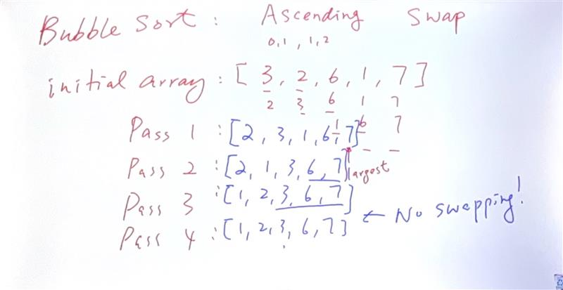

# Bubble sort (ASCENDING)
E.G.1:<BR>unsorted=[1,4,2,3] <BR>
1st pass : 1,4,2,3 <BR>
2nd pass : 1,2,4,3 <BR>
3nd pass : 1,2,3,4 <BR>

```
def bubble_sorted(iterable):
    new_list = list(iterable)
    list_len = len(new_list)
    for i in range(list_len-1):
        for j in range(list_len - i - 1):
            if new_list[j] > new_list[j + 1]:
                new_list[j], new_list[j + 1] = new_list[j + 1], new_list[j]
    return new_list

```
<BR>
unsorted=[2,4,1,3]<br>
1st place: 2,4,1,3<br>
2,4,1,3<br>
2,1,4,3<br>
2,1,3,4<br>

# Bubble Sort in Python (ai teach)

Bubble Sort is a simple sorting algorithm that repeatedly steps through the list to be sorted, compares adjacent elements, and swaps them if they are in the wrong order. The pass through the list is repeated until the list is sorted.

## How Bubble Sort Works

1. Start at the beginning of the list.
2. Compare the first two adjacent elements.
3. If the first element is greater than the second, swap them.
4. Move to the next pair of adjacent elements and repeat the process.
5. Continue this until the end of the list is reached.
6. Repeat the entire process for the list until no swaps are needed, indicating that the list is sorted.

## Python Implementation

Here is a simple implementation of Bubble Sort in Python:

```python
def bubble_sort(arr):
    n = len(arr)
    # Traverse through all array elements
    for i in range(n):
        # Last i elements are already in place
        for j in range(0, n-i-1):
            # Traverse the array from 0 to n-i-1
            # Swap if the element found is greater
            # than the next element
            if arr[j] > arr[j+1]:
                arr[j], arr[j+1] = arr[j+1], arr[j]

# Example usage
arr = [64, 34, 25, 12, 22, 11, 90]
bubble_sort(arr)
print("Sorted array:", arr)

#notes

